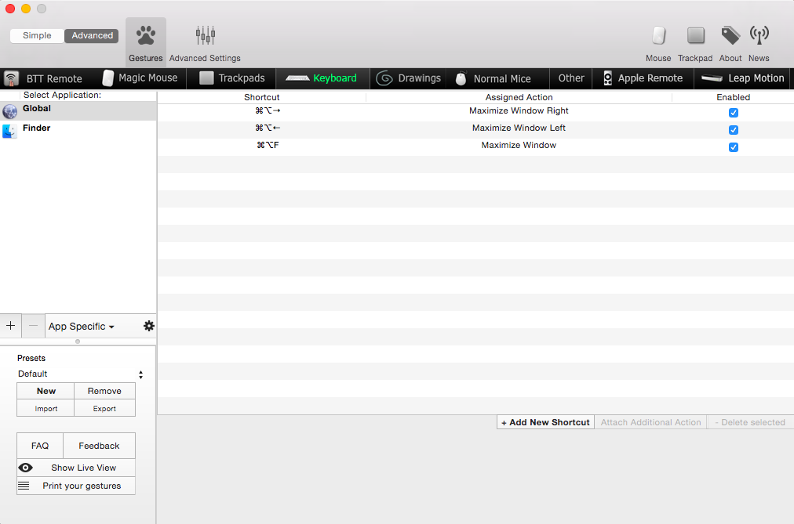
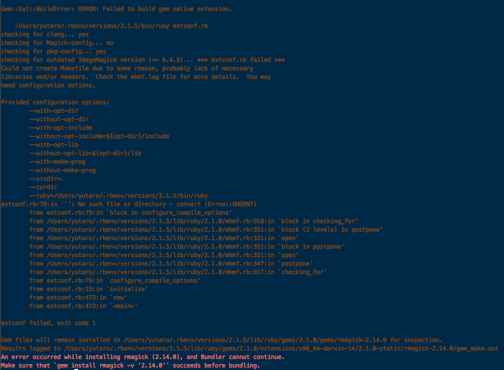

普段使っているメイン機 MacBook Air (13-inch, Mid 2012) が，突然落ちたりファンの音がうるさすぎたりしたので，クリーンインストールした．

普段はRuby/Railsで開発しているので，ついでにセットアップ手順もまとめておく．

(そろそろ新しいMac買おうと思ってたけど，クリーンインストールでサクサク動くようになったΣ(゜Д゜；))

## 再インストールする前に何点か確認

* ローカルで必要なデータはどこかにコピーしておく
* chromeのブックマークをGoogleアカウントにsyncしているか確認
https://www.google.com/settings/u/2/chrome/syncから数とか確認できる
* cloneしているリポジトリのlocalブランチをpushしているか

## HDD初期化と再インストール

* Macを再起動し，グレーの画面で ⌘ + R を押し続けるとOSユーティリティが起動
* ディスクユーティリティで Macintosh HDを消去
* OSユーティリティに戻ってOS再インストール

## 共通環境設定

* caps lock と control を入れ替え
* 言語を英語に変更
* <a href="https://www.google.co.jp/ime/" target="_blank">Google IME
</a>インストールし，ひらがなのみを適用
* <a href="http://www.bettertouchtool.net/" target="_blank">BetterTouchTool

* [Karabiner](http://qiita.com/daichi87gi/items/ded35e9d9a54c8fcb9d6 "Karabiner")
* 隠しファイル表示
    * $ defaults write com.apple.finder AppleShowAllFiles TRUE

## よくつかうアプリ

* Chrome
* Slack
* Rubymine
アプリケーション起動時にJVMのinstallが必要
* WebStorm
* SourceTree
* iTerm2

## コマンドラインツール

* node
    * $ brew install node
* npm
    * $ curl -O -L https://npmjs.org/install.sh
* bower
    *  $ npm install -g bower
* grunt
    * $ npm install -g grunt-cli
* brew
    * $ ruby -e "$(curl -fsSL https://raw.githubusercontent.com/Homebrew/install/master/install)"
* Git・GitHub
    * $ brew install git
    * $ ssh-keygen -t rsa -C "mail@mail.com"
        パスワードは空でもOK
    * $ pbcopy &lt; ~/.ssh/id_rsa.pub
    * GitHubのSSH Key設定ページに作成した公開鍵を登録
    * config

    * $ git config --global user.name "Name"
    * $ git config --global user.email mail@mail.com
    * その他普段使っているaliasを設定
* vim
    * $ brew install vim
* rbenv
    * $ brew install rbenv ruby build
* ruby
    * $ rbenv install --list
    * $ rbenv install x.x.x
    * $ rbenv --global x.x.x (任意)
* bundler
    * $ gem install bundler

## Rails Project

* プロジェクトをクローンする
* mysql
    * $ brew install mysql
    * root user作成
    * $ mysqladmin -u root password <em>PASS</em>
    * $ mysql -u root -p でログインできるか確認

    * Railsで使用するユーザを作成

    * mysql&gt; create user '<em>xxx-dev</em>'@localhost identified by '<em>PASS</em>';
    * mysql&gt; grant all on *.* to '<em>xxx-dev</em>'@'localhost';
    * mysql&gt; create user '<em>xxx-test</em>'@localhost identified by '<em>PASS</em>';
    * mysql&gt; grant all on *.* to '<i>xxx-test</i>'@'localhost';

* ignoreしているファイルを追加
    * config/secrets.yml
    * config/database.yml
    * .rspec

* Gemfile追加

    * $ bundle install
    * (このエラーがでた場合)
    

    * $ brew install imagemagick
        (rmagickがimagemagickを使用するが，imagemagickはgemでinstallできないため，マシンのを参照しようとするがinstallされていないことが原因)

* $ rake db:create
* $ bundle exec rake db:migrate RAILS_ENV=development
* $ bundle exec rails s
